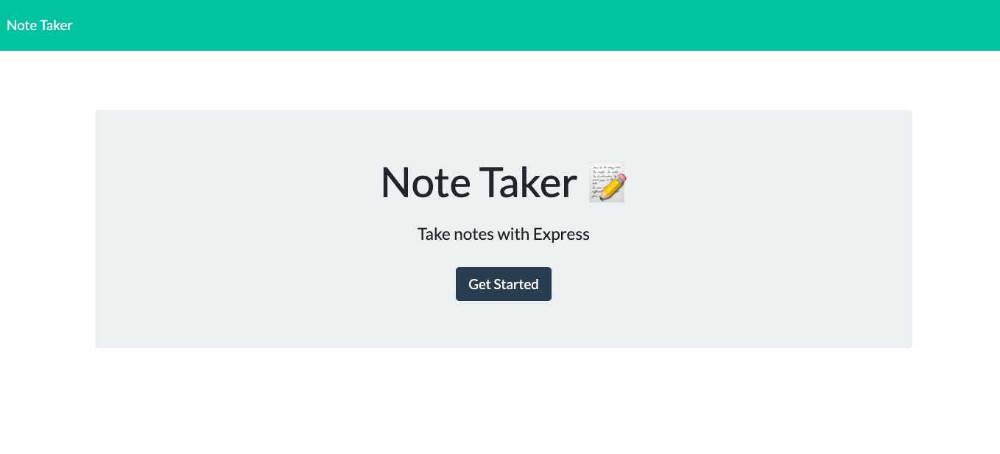
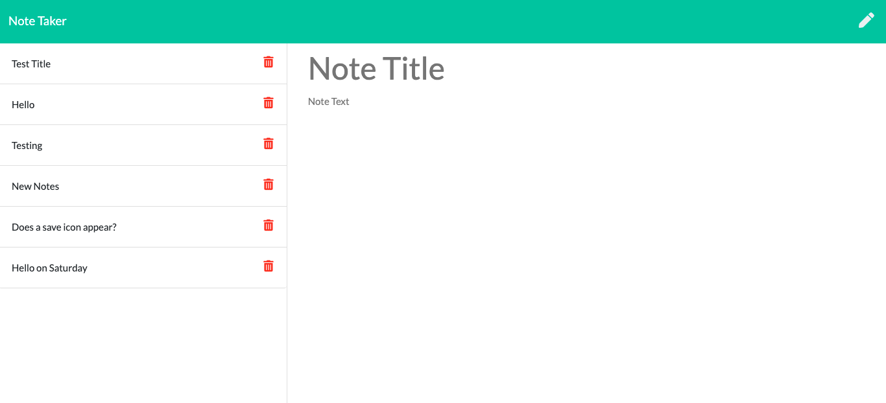
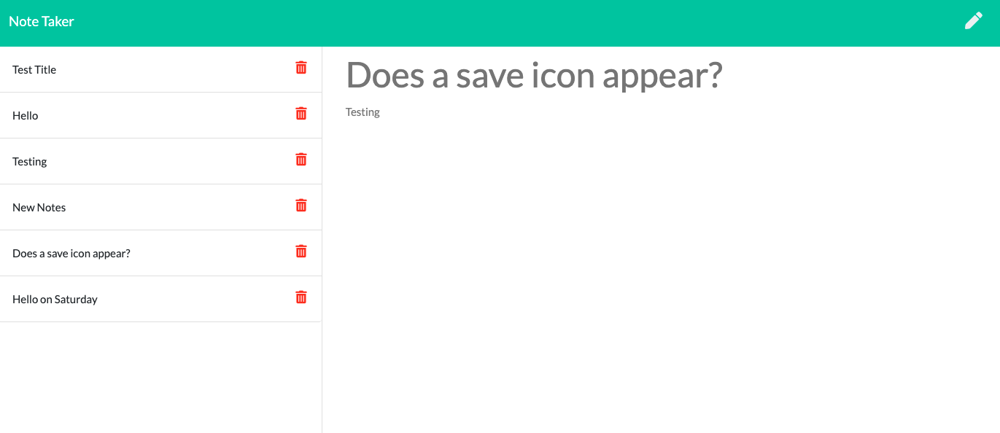

# Challenge-11-Note-Taker-Express.js

  ## Description
  Your challenge is to create an application called Note Taker that can be used to write and save notes. This application will use an Express.js back end and will save and retrieve note data from a JSON file.

  ## Table of Contents 
  * [Installation](#installation)
  * [Usage](#usage)
  * [BuiltWith](#builtwith)
  * [Acceptance](#acceptance)
  * [Contributing](#contributing)
  * [DeployedLink](#deployedlink)
  * [Screenshots](#screenshots)
  * [Resources](#resources)
  * [Questions](#questions)


  ## Installation
  npm install

  ## Usage
  ```
  AS A small business owner
  I WANT to be able to write and save notes
  SO THAT I can organize my thoughts and keep track of tasks I need to complete
  ```

  ## BuiltWith
  * HTML
  * CSS
  * Bootstrap
  * JavaScript
  * Express.js
  * Node.js
  * UUID

  ## Acceptance
  ```
  GIVEN a note-taking application
  WHEN I open the Note Taker
  THEN I am presented with a landing page with a link to a notes page
  WHEN I click on the link to the notes page
  THEN I am presented with a page with existing notes listed in the left-hand column, plus empty fields to enter a new note title and the note’s text in the right-hand column
  WHEN I enter a new note title and the note’s text
  THEN a Save icon appears in the navigation at the top of the page
  WHEN I click on the Save icon
  THEN the new note I have entered is saved and appears in the left-hand column with the other existing notes
  WHEN I click on an existing note in the list in the left-hand column
  THEN that note appears in the right-hand column
  WHEN I click on the Write icon in the navigation at the top of the page
  THEN I am presented with empty fields to enter a new note title and the note’s text in the right-hand column
  ```

  ## Contributing
  This project is not open for contributions at this time.

  ## DeployedLink
  [Note Taker](https://jerismith32.github.io/challenge-11-note-taker/)

  ## Screenshots
  
  
  

  ## Resources
  
  [Nodemon Documentation](https://www.npmjs.com/package/nodemon)

  [Reading Files with Node.js](https://nodejs.dev/learn/reading-files-with-nodejs)

  [How to Generate Unique ID](https://dev.to/rahmanfadhil/how-to-generate-unique-id-in-javascript-1b13)

  [UUID Documentation](https://www.npmjs.com/package/uuid)

  [Express Documentation](https://expressjs.com/en/4x/api.html)

  [Express Routing](https://expressjs.com/en/starter/basic-routing.html)

  ## Questions
  GitHub: jerismith32

  Email: jerismith32@gmail.com
